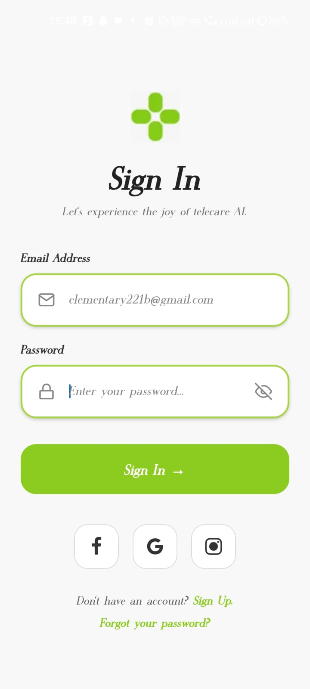

# 📱Sign In UI (React Native)

A modern, clean and responsive **Sign In screen UI** built using **React Native (Expo)**.  
This UI is designed with a minimal and user-friendly design.

---

## 🖼️ App Preview



## ✨ Features

- Clean and modern UI design
- Email & Password input fields with icons
- Custom green theme (#8CCB1F)
- Social login buttons (Facebook, Google, Instagram)
- Smooth layout using Flexbox
- Mobile-friendly responsive design
- Built using Expo Vector Icons

---

## 🖼️ UI Preview

> This screen includes:
- App Logo section
- Sign In title + subtitle
- Email & Password input fields
- Sign In button
- Social login icons
- Signup & Forgot password links

---

## 🛠️ Tech Stack

- React Native
- Expo
- React Native Safe Area Context
- Expo Vector Icons

---

## ⚡ Quick Start

```bash
git clone https://github.com/intekhabx/RN-expo-signin-screen.git
bun install
bunx expo start
```

---

## ⭐ Show Your Support

If you like this project:
- ⭐ Star the repository
- 🍴 Fork it
- 🛠️ Improve it
- 📢 Share it with others

---

## 🎉 Thank You!

Thanks for checking out this UI 🙌  